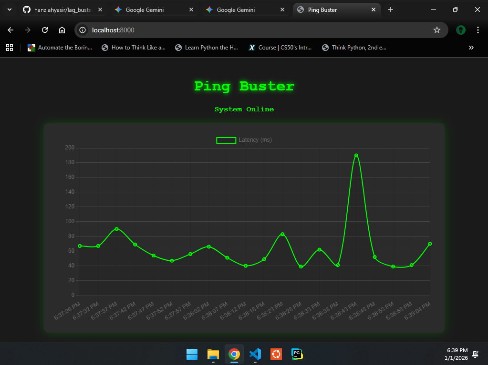

# Network Telemetry Dashboard (Lag Buster)

  

**A real-time network stability monitoring tool designed for high-performance gaming environments.**


_(Run the application to see the live data stream)_

## Overview

In game development and e-sports, network stability is critical. Standard ping tools offer static numbers, but they often miss micro-stutters and jitter that ruin multiplayer experiences.

**Lag Buster 2.0** is a Full-Stack telemetry tool that:

1.  **Monitors** network latency in real-time using Python `subprocess`.
2.  **Streams** data to a web dashboard via **WebSockets** (Async).
3.  **Visualizes** stability trends using **Chart.js** to identify lag spikes instantly.

## Key Features

- **Real-Time Telemetry:** Uses WebSockets to push data instantly (no page refreshing required).
- **Gamer-Centric UI:** Dark mode dashboard designed for low-light studio environments.
- **Live Visualization:** Rolling line chart that tracks the last 20 seconds of network performance.
- **Cross-Platform Engine:** Auto-detects OS (Windows/Linux) to adjust ping commands dynamically.

## Tech Stack

- **Backend:** Python 3, FastAPI (Async Framework), Uvicorn.
- **Protocol:** WebSockets (Full-duplex communication).
- **Frontend:** HTML5, CSS3, JavaScript (Vanilla).
- **Visualization:** Chart.js.

## Installation & Setup

### 1. Clone the Repository

```bash
git clone [https://github.com/yourusername/network-telemetry-dashboard.git](https://github.com/yourusername/network-telemetry-dashboard.git)
cd lag_buster
```

### 2. Install the Dependencies

```bash
pip install -r requirements.txt
```

### 3. Run the Server

```bash
uvicorn main:app --reload
```

### 4. Access the Dashboard

Open your browser and navigate to: `http://localhost:8000`

## Project Structure

```bash
├── main.py           # The FastAPI application & WebSocket logic
├── get_ping.py       # Python script for OS-level network checks
├── index.html        # Frontend dashboard (Chart.js + WebSocket client)
├── requirements.txt  # Dependencies
└── README.md         # Documentation
```

## 🧠 How It Works (Architecture)

1.  **The Sensor:** `get_ping.py` executes a shell command to ping a target server (Default 1.1.1.1).
2.  **The API:** `main.py` opens a WebSocket channel at ws/ping.
3.  **The Stream:** The server runs an asynchronous loop, fetching ping data and serializing it to JSON.
4.  **The Client:** `index.html` connects to the WebSocket, parses the JSON, and updates the Chart.js array in real-time.

## Future Improvements

- Add ability to change Target IP (e.g., Game Server) from the UI.
- Save long-term logs to a CSV/Database for post-mortem analysis.
- Implement desktop notifications for "Connection Lost" events.

---

Built by [Hanzlah](https://linkedin.com/in/hanzlah-yasir) - Google Certified IT Automation Specialist
